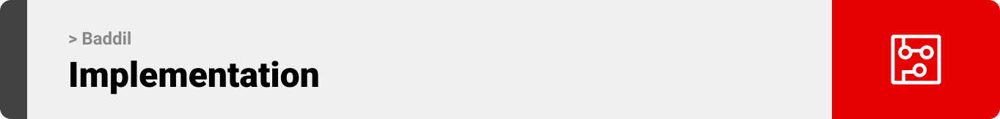

<br><br>

<!-- project philosophy -->


> A platform revolutionizing the bartering experience by connecting users, brokers, and admins through a seamless and interactive system.
>
> Baddĭl aims to redefine how people trade goods and services by introducing modern tools like AI assistance, dynamic user interfaces, and automated workflows. We believe in fostering a community of trust and efficiency, empowering users to achieve their bartering goals effortlessly.


### Admin Stories

- As an admin, I want to flag suspicious activities, so I can ensure a safe and trustworthy platform.
- As an admin, I want to manage notifications, so I can keep users informed about important updates.
- As an admin, I want to handle disputes between users, so I can ensure fair resolutions and maintain a positive community.

### Barterer Stories

- As a barterer, I want to verify the identity of the person I’m trading with, so I can feel secure during the exchange.
- As a barterer, I want to communicate through a secure chat system, so I can ensure that all discussions remain within the platform.
- As a barterer, I want help planning my bartering goals, so I can receive recommendations on how to reach my desired item efficiently.

### Broker Stories

- As a broker, I want to manage trade deadlines on a calendar, so I can efficiently organize my clients' trades.
- As a broker, I want to manage my income from clients and the platform, so I can keep track of my earnings and monitor performance.
- As a broker, I want to view trade details easily, so I can provide accurate advice and support to my clients.

<br><br>

<!-- Tech stack -->


### Baddĭl is built using the following technologies

- This project uses the [Nest.js](https://nestjs.com/) framework for the backend. Nest.js is a progressive Node.js framework built with TypeScript, enabling efficient and scalable server-side development.
- For the database, the app uses [MongoDB](https://www.mongodb.com/). MongoDB is a NoSQL database that stores data in flexible, JSON-like documents, which makes it ideal for rapidly evolving applications like Baddĭl.
- The mobile app is developed using [React Native](https://reactnative.dev/). React Native allows for building mobile apps for iOS and Android using a single codebase, leveraging the power of React.
- The broker web app is developed using [Next.js](https://nextjs.org/). Next.js is a React framework that enables server-side rendering and static site generation for optimized performance and SEO.
- The admin desktop app is built using [Electron](https://www.electronjs.org/), which wraps the Next.js app to provide a seamless desktop experience across platforms.

<br><br>
<!-- UI UX -->


> We designed Coffee Express using wireframes and mockups, iterating on the design until we reached the ideal layout for easy navigation and a seamless user experience.

- Project Figma design [figma](https://www.figma.com/file/LsuOx5Wnh5YTGSEtrgvz4l/Purrfect-Pals?type=design&node-id=257%3A79&mode=design&t=adzbABt5hbb91ucZ-1)

### Mockups

| Home screen  | Menu Screen | Order Screen |
| ---| ---| ---|
|  |  |  |

<br><br>

<!-- Database Design -->


### Architecting Data Excellence: Innovative Database Design Strategies

- Insert ER Diagram here

<br><br>

<!-- Implementation -->


### User Screens (Mobile)

| Login screen  | Register screen | Landing screen | Loading screen |
| ---| ---| ---| ---|
|  |  |  |  |
| Home screen  | Menu Screen | Order Screen | Checkout Screen |
|  |  |  |  |

### Admin Screens (Web)

| Login screen  | Register screen |  Landing screen |
| ---| ---| ---|
|  |  |  |
| Home screen  | Menu Screen | Order Screen |
|  |  |  |

<br><br>

<!-- Prompt Engineering -->


### Mastering AI Interaction: Unveiling the Power of Prompt Engineering

- This project uses advanced prompt engineering techniques to optimize the interaction with natural language processing models. By skillfully crafting input instructions, we tailor the behavior of the models to achieve precise and efficient language understanding and generation for various tasks and preferences.

<br><br>

<!-- AWS Deployment -->


### Efficient AI Deployment: Unleashing the Potential with AWS Integration

- This project leverages AWS deployment strategies to seamlessly integrate and deploy natural language processing models. With a focus on scalability, reliability, and performance, we ensure that AI applications powered by these models deliver robust and responsive solutions for diverse use cases.

<br><br>

<!-- Unit Testing -->


### Precision in Development: Harnessing the Power of Unit Testing

- This project employs rigorous unit testing methodologies to ensure the reliability and accuracy of code components. By systematically evaluating individual units of the software, we guarantee a robust foundation, identifying and addressing potential issues early in the development process.

<br><br>

<!-- How to run -->


> To set up Coffee Express locally, follow these steps:

### Prerequisites

This is an example of how to list things you need to use the software and how to install them.

- npm

  ```sh
  npm install npm@latest -g
  ```

### Installation

_Below is an example of how you can instruct your audience on installing and setting up your app. This template doesn't rely on any external dependencies or services._

1. Get a free API Key at [example](https://example.com)
2. Clone the repo
   git clone [github](https://github.com/your_username_/Project-Name.git)
3. Install NPM packages

   ```sh
   npm install
   ```

4. Enter your API in `config.js`

   ```js
   const API_KEY = 'ENTER YOUR API';
   ```

Now, you should be able to run Coffee Express locally and explore its features.
