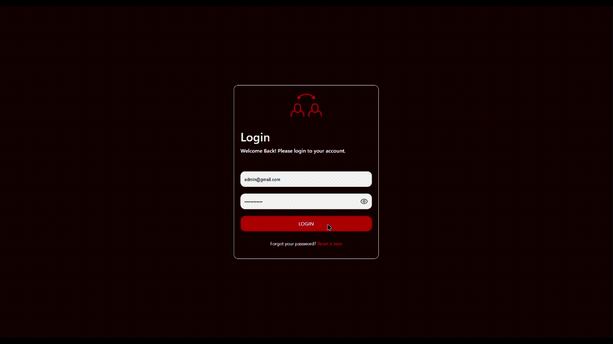

<br><br>

<!-- project philosophy -->


> Baddil is a platform that aims to simplify the process of bartering in a secure way!
> Baddil aims to redefine how people trade goods and services by introducing modern tools like AI assistance, dynamic user interfaces, and automated workflows.
> The vision of Baddil is to create a community of trust and efficiency, empowering users to achieve their bartering goals effortlessly.

### User Stories

#### Admin

- As an admin, I want to flag suspicious activities, so I can ensure a safe and trustworthy platform.
- As an admin, I want to manage notifications, so I can keep users informed about important updates.
- As an admin, I want to handle disputes between users, so I can ensure fair resolutions and maintain a positive community.

#### Barterer

- As a barterer, I want to verify the identity of the person I’m trading with, so I can feel secure during the exchange.
- As a barterer, I want to communicate through a secure chat system, so I can ensure that all discussions remain within the platform.
- As a barterer, I want help planning my bartering goals, so I can receive recommendations on how to reach my desired item efficiently.

#### Broker

- As a broker, I want to manage trade deadlines on a calendar, so I can efficiently organize my clients' trades.
- As a broker, I want to manage my income from clients and the platform, so I can keep track of my earnings and monitor performance.
- As a broker, I want to view trade details easily, so I can provide accurate advice and support to my clients.

<br><br>

<!-- Tech stack -->


### Baddil is built using the following technologies

- Server-side is developed using [Nest.js](https://nestjs.com/) framework.

- Database is developed using [Prisma](https://www.prisma.io/) with [MySQL](https://www.mysql.com/products/workbench/).

- Mobile app is developed using [Expo](https://expo.dev/) on top of [React Native](https://reactnative.dev/).

- Admin and broker web apps are developed using [React](https://react.dev/) + [Vite](https://vite.dev/).

- Runtime and task management are handled by [Bun](https://bun.sh/).

- The primary language used was [TypeScript](https://www.typescriptlang.org/).

- Authentication is handled through [Firebase](https://firebase.google.com/) and [JWT](https://jwt.io/).

- State management on the frontend is handled using [Redux](https://redux.js.org/).

- AI features, including recommendations, trade planning, and analysis, are powered by [OpenAI](https://openai.com/).

<br><br>

<!-- UI UX -->


> We designed Baddil with a user-centric approach, emphasizing simplicity, clarity, and ease of use. Multiple wireframes were tested, and mockups were iterated upon to ensure a design that aligns with the vision of Baddil.

- Project Figma design [figma](https://www.figma.com/design/mQS7bXZeXgdcuBRzxnVaNN/Badd%C4%ADl-Project?m=auto&t=i0kwRwvZMlqeEVbU-1)

### Mockups

| Home Screen                                      | Brokers Screen                                  | Item Screen                                   |
| ------------------------------------------------ | ----------------------------------------------- | --------------------------------------------- |
|  |  |  |

<br><br>

<!-- Database Design -->


### Architecting Data Excellence: Innovative Database Design Strategies

- To explore the Prisma schema models, click [here]("./readme/schema").

<br><br>

<!-- Implementation -->


### Barterer Screens (Mobile)

| Onboarding screen                                    | Home screen                                    | Add Item screen                                    |
| ---------------------------------------------------- | ---------------------------------------------- | -------------------------------------------------- |
|  |        |      |
| Chat screen                                          | Profile Screen                                 | Meetup Verify Screen                               |
|           |  |  |

### Admin Screens (Web)

| Overview screen                                  | Users Submenu screen                          |
| ------------------------------------------------ | --------------------------------------------- |
|  |     |
| Insights Submenu screen                          | Finances Submenu Screen                       |
|  |  |

<br><br>

<!-- Prompt Engineering -->


### Mastering AI Interaction: Unveiling the Power of Prompt Engineering

- AI is at the heart of Baddil! We leveraged the [OpenAI](https://openai.com/index/openai-api/) API and prompt engineering to deliver powerful features: recommending the most relevant category to search in, evaluating user credibility, and suggesting the optimal item from the user's wallet to barter with.

| Prompts                                         |                                                          |
| ----------------------------------------------- | -------------------------------------------------------- |
|     |  |
|  |      |

<br><br>

 <!-- AWS Deployment -->


### Efficient AI Deployment: Unleashing the Potential with AWS Integration

- Baddil leverages AWS for seamless deployment ensuring scalability, reliability, and high performance. The backend server is hosted on an EC2 instance.
<!-- TODO: add the point of postman documentation and screenshot of postman api in action  -->
<!-- How to run -->


> To set up Baddil locally, follow these steps:

### Prerequisites

First of all you need your runtime environment. Baddil uses "Bun" to be set up. You can install bun by running the following command:

- [bun](https://bun.sh/docs/installation)

  ```sh
  npm install -g bun
  ```

### Installation

_Below are instructions how to run Baddil._

#### Common Steps:

1. Clone the repository:

```sh
git clone https://github.com/IbrahimItani01/baddil.git
```

2. Install dependencies

   ```sh
   bun install
   ```

#### Server-Side

1. Setup [Firebase]("https://firebase.google.com/") project for authentication.

2. Obtain your [OpenAI]("https://openai.com/index/openai-api/") api.

3. Create your [MySQL]("https://www.mysql.com/products/workbench/") database.

4. Visit the .env.example file and follow the key-naming structure.

#### Client-Side

1. Check in ./apis/main.ts the currentIp. Change its values to your currentIp.

Now, you should be able to run Baddil locally and explore its features!
